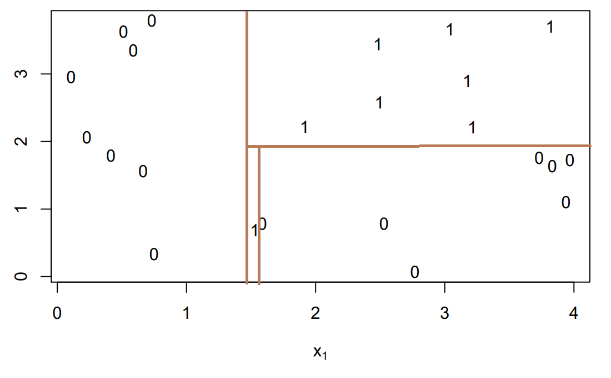
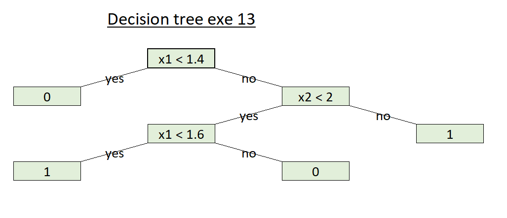

# Problem 9


## Task a
$$p_k(x)\equiv P(Y=k\mid X=x) = \frac{p_k(x)\equiv P(X=x\mid Y=y) \times P(Y=k)}{P(X=x)}$$

We know that:

$P(X=x\mid Y=y) = f_k(x) = \frac{1}{\sqrt{2 \pi} \sigma_{k}} \exp \left(-\frac{1}{2 \sigma_{k}^{2}}\left(x-\mu_{k}\right)^{2}\right)$

$P(Y=k) =\pi_k$

$P(X=x) = \sum_{l=1}^k{P(X=x, Y=l)} =\sum_{l=1}^k{P(X=x\mid Y=l) \times P(Y=l)} =  \sum_{l=1}^k{\pi_k \times P(Y=l)}$


Therefore:
$$p_k(x)\equiv P(Y=k\mid X=x) =f_k(x) \times \frac{\pi_k}{\sum_{l=1}^k{\pi_k \times P(Y=l)}} =\frac{\pi_k \times  \frac{1}{\sqrt{2 \pi} \sigma_{k}} \exp \left(-\frac{1}{2 \sigma_{k}^{2}}\left(x-\mu_{k}\right)^{2}\right)}{ \sum_{l=1}^k\pi_l\times\frac{1}{\sqrt{2 \pi} \sigma_{k}} \exp \left(-\frac{1}{2 \sigma_{k}^{2}}\left(x-\mu_{k}\right)^{2}\right)}$$

## Task b
The equation 4.12 from the book gives us: 

$$p_k(x) = \frac{\pi_k\frac{1}{\sqrt{2\pi\sigma}}\times \exp(-\frac{1}{2\sigma^2}(x-\mu_k)^2)}{ \sum_{l=1}^k\pi_l\times\frac{1}{\sqrt{2 \pi} \sigma_{k}} \exp \left(-\frac{1}{2 \sigma_{k}^{2}}\left(x-\mu_{k}\right)^{2}\right)}$$

Maximizing this function would be the same as maximizing its log therefore we will calculate it:

$$log(p_k(x)) = log(\frac{\pi_k\frac{1}{\sqrt{2\pi\sigma}} \exp(-\frac{1}{2\sigma^2}(x-\mu_k)^2)}{ \sum_{l=1}^k\pi_l\frac{1}{\sqrt{2 \pi} \sigma_{k}} \exp \left(-\frac{1}{2 \sigma_{k}^{2}}\left(x-\mu_{k}\right)^{2}\right)})$$

using: 

$$log(a/b) = log(a) -log(b)$$
$$log(a\times b) = log(a) +log(b)$$

Using also the fact that all the $\sigma_i$ are equal

We get:
$$log(p_k(x)) =log(\pi_k\frac{1}{\sqrt{2\pi\sigma}}\exp(-\frac{1}{2\sigma^2}(x-\mu_k)^2)) - log({ \sum_{l=1}^k\pi_l\frac{1}{\sqrt{2 \pi} \sigma_{k}} \exp \left(-\frac{1}{2 \sigma_{k}^{2}}\left(x-\mu_{k}\right)^{2}\right)}) $$
$$= log(\pi_k) + log(\frac{1}{\sqrt {2\pi\sigma}}) -\frac{1}{2\sigma^2}(x-\mu_k)^2 - log({ \sum_{l=1}^k\pi_l\frac{1}{\sqrt{2 \pi} \sigma_{k}} \exp \left(-\frac{1}{2 \sigma^{2}}\left(x-\mu_{k}\right)^{2}\right)})$$

We will develope the squared term and get:

$$log(p_k(x) )= log(\pi_k) + log(\frac{1}{\sqrt {2\pi\sigma}}) -\frac{1}{2\sigma^2}x^2-\frac{1}{2\sigma^2}\mu_k^2 + \frac{x\mu_k}{\sigma^2} - log{( \sum_{l=1}^k\pi_l\frac{1}{\sqrt{2 \pi} \sigma_{k}} \exp \left(-\frac{1}{2 \sigma^{2}}\left(x-\mu_{l}\right)^{2}\right))}$$

$ArgMax_k(log(p_k(x)))$ doesn't depend from the terms that are independent from k. Therefore we can remove them from the expression. And since $\sigma$ is the same for all $x_k$ we can also remove the terms with $\sigma$. Therefore :

$$ArgMax_k(log(p_k(x))) = Argmax( log(\pi_k)  -\frac{x^2}{2\sigma^2}-\frac{1}{2\sigma^2}\mu_k^2 + \frac{x\mu_k}{\sigma^2} - log{( \sum_{l=1}^K\pi_l\frac{1}{\sqrt{2 \pi} \sigma_{k}} \exp \left(-\frac{1}{2 \sigma^{2}}\left(x-\mu_{l}\right)^{2}\right))})$$

The last term (the sum) is also independent from k therefore we can remove it and we get: 
$$Argmax_k(p_k(x)) = Argmax_k(log(p_k(x)))= Argmax_k(log(\pi_k)  -\frac{1}{2\sigma^2}\mu_k^2 + \frac{x\mu_k}{\sigma^2} )$$

## Problem 10

### Task a

```{r}
# Import libraries
library(datasets)
library(dplyr)
library(splitstackshape)
library(data.table)

# Import Iris
data(iris)

# Add id column. Will be needed in anti_join.
iris$id <- seq.int(nrow(iris))

# Update species column. New values: Virginica and notvirginica.
iris <- mutate(iris, Species = ifelse(Species == "virginica", "virginica","notvirginica"))

# Split to test and train set using stratified sampling. 50% from both species to both train and test sets.
train <- as.data.frame(stratified(iris, "Species", .5))
test <- as.data.frame(anti_join(iris, train, by="id"))

# Drop id used in join
train$id <- NULL
test$id <- NULL
iris$id <- NULL

# Print info of train and test sets
str(test)
str(train)
```

### Task b

#### Compute and report the means and standard deviations of each of the attributes in the training set for the both classes separately
```{r}
# Create frames train_virginica_features and train_notvirginica_features. 
train_virginica_features <- train[train$Species == "virginica", ]
train_notvirginica_features <- train[train$Species == "notvirginica", ]

# Remove species from feature dataframes
train_virginica_features$Species <- NULL
train_notvirginica_features$Species <- NULL

# Print mean of train_virginica_features
apply(train_virginica_features, 2, mean)

# Print mean of train_notvirginica_features
apply(train_notvirginica_features, 2, mean)

# Print standard deviation of train_virginica_features
apply(train_virginica_features, 2, sd)

# Print standard deviation of train_notvirginica_features
apply(train_notvirginica_features, 2, sd)
```

#### Estimate and report the class probabilities, using Laplace smoothing with pseudocount of 1 on the training set.

Laplacian smoothing can be calculated with following formula. We will use pseudocount m=1 and we have n=75.

$$\hat{P}(Y=y)=\frac{m+\sum_{i=1}^{n} l(y_{i}=y)}{2m+n}=\frac{1+\sum_{i=1}^{n} l(y_{i}=y)}{2+n}$$
When species is not virginica, then y=0 and class probability is

$$\hat{P}(Y=0)=\frac{50+1}{75+2} = \frac{51}{77}$$
When species is virginica, then y=1 and class probability is

$$\hat{P}(Y=1)=\frac{25+1}{75+2} = \frac{26}{77}$$

### Task c

Now you can find the class-specific expressions for $p(x\mid y)$ needed by the NB classifier. Remember that according to NB assumption the dimensions are independent, and hence, you can represent the class-specific $p(x\mid y)$ likelihoods as products of 4 1-dimensional normal distributions. Write down the formula needed to compute the posterior probability of the class being `virginica` $\hat p(y={\rm{virginica}}\mid x)$ as a function of the four morphological measurements in $x$ and the statistics (means, standard deviations, class probabilities) you computed in the task b above.


$$p(x|y)=$$


### Task d

Compute and report the classification accuracy for you classifier on the test set.

**Hint:** When computing classification accuracy you can use the following rule to obtain "hard" classes,$$
\hat y=\left\{\begin{array}{lcl}{\rm{virginica}}&,&\hat p(y={\rm{virginica}}\mid x)\ge 0.5\\
{\rm{notvirginica}}&,&\hat p(y={\rm{virginica}}\mid x)<0.5\end{array}\right.$$

```{r}
library(e1071)
#install.packages('caret', dependencies = TRUE)
library(caret)

# Train the model
model <- naiveBayes(Species~., data=train, laplace = 1)

# Predict results
prediction <- predict(model, newdata=test, type="raw")

# Change prediction to dataframe
#prediction <- as.data.frame(prediction)

# Join frame test and prediction to get true labels
results <- data.frame(test, prediction)

# Drop all columns except Species and p(virginica)
results <- results[,c("Species", "virginica")]

# Hardcode probability limits
results <- mutate(results, virginica = ifelse(virginica >= 0.5, "virginica","notvirginica"))

# Rename colums
colnames(results)[1] <- "true_Species"
colnames(results)[2] <- "pred_Species"

# Show results dataframe
results

# Calculate number of correct predictions
count_correct <- nrow(results[results$true_Species == results$pred_Species,])

# Print the probability of correct prediction
paste("Model accurancy:", count_correct/nrow(test))
```


### Task e

Repeat task d above, but with logistic regression. (Logistic regression may give you a warning about convergence. Can you explain why if this happens?) Make two plots: one for the training data and one for test data where the x-axis value is the linear response (you get this directly out of `predict`, if you use R; see the code below) and the y-axis value is 1 for the class `virginica` and 0 for the class `notvirginica`.

```{r,warning=FALSE,message=FALSE}
library(GGally)
## Create new data with Species in "virginica" or "notvirginica"
data("iris")
data2 <- iris

data2$Species <- factor("virginica",levels=c("virginica","notvirginica"))
data2$Species[iris$Species!="virginica"] <- "notvirginica"

ggpairs(data2,aes(color=Species,alpha=0.4),
        upper=list(continuous=wrap("cor", size=2)))+
  theme(text=element_text(size=7))
```


**Hint to task e:** If you use R: You can do logistic regression with `glm`. Also see examples in James et al.!

```{r,echo=TRUE,eval=FALSE}
## Assume your training data is in data2_train and test data
## in data2_test.

# Change species to binomial 0, 1 values
data2_test <- mutate(test, Species = ifelse(Species == "virginica", 1,0))
data2_train <- mutate(train, Species = ifelse(Species == "virginica", 1,0))

## First train a logistic regression model m.
m <- glm(Species ~ ., data2_train, family=binomial)

## "link" (the default output of predict, see R help page: ?predict.glm)
## is the linear response (the term \betaˆTx). The predicted
## probability would be sigmoid of this response or \sigma(\betaˆTx).
link <- predict(m, test, type = c("link", "response", "terms"))

## Predictions (probability of 0.5 is at link==0):
## (PS. I hope I got the classes the right way...)
yhat <- ifelse(link<0,"virginica","notvirginica")

## Summary of results:
print(summary(m))
```
```{r,echo=TRUE,eval=FALSE}

# Create test and train dataframes with binary Species values
test_binary <- mutate(test, Species = ifelse(Species == "virginica", 1,0))
train_binary <- mutate(train, Species = ifelse(Species == "virginica", 1,0))

# Join test_binary and yhat dataframes
prediction <- data.frame(test_binary, link)

# Plot prediction valyes and species
plot(prediction$link, prediction$Species, type="p", main="Test set linear response", ylab="Notvirginica=0, Virginica=1", xlab="Linear response")


# Do same for train set
link <- predict(m, train, type = c("link", "response", "terms"))
yhat <- ifelse(link<0,"virginica","notvirginica")
prediction2 <- data.frame(train_binary, link)
plot(prediction2$link, prediction2$Species, type="p", main="Train set linear response", ylab="Notvirginica=0, Virginica=1", xlab="Linear response")

```


# Problem 11

## Task a

As explained in the abstract of the paper, discriminative learning has a lower asymptotic error , while a generative classifier may  approach its asymptotic error much faster.
This why, in general we consider the dicriminative classifiers as better models compared to generative ones. However, due to its fast convergence, a generative classifier could perform better if it is applied on small data. In that case, a dicriminative classifier won't have enough data to achieve its low error while a generative one will converge to its lower error which in this case will be much better than the dicrminative's one. 

To conclude, the performance of each of the two models is affected by the data size. If we have smaller data, a generative model will be better while for other cases a discriminative one would be better.

## Task b 

As found in the end of the introduction: 

$h_{Gen}$ and $h_{Dis}$ are a Generative-Discriminative pair. $h_{Gen}$ focuses on maximizing the joint likelihood p(x,y) while $h_{Dis}$'s main goal is to maximize the conditional likelihood $p(y|x)$. Where x are the predictors and y are the labels. However these two models could also maximize the log of the likelihood ( resp. log of the contitional likelihood) instead of the likelihood (resp. conditional likelihood).

The author discusses two different families. The first one is when $p(x|y)$ is Gaussian (normal distribution) with p(y) multinomial. In this case the generative pair is NDA (Normal discriminant Analysis) and logistic regression. The other one is with discrete inputs. In this case the pair is Bayes classifier and logistic regression.

## Task c

In these figure, dashed line is logistic regression (discriminative); solid  line is naive Bayes(generative).
The idea explained at the end of the introduction is perfectly demonstrated in these figures. In the majority the figures, we can see that the solid line is lower than the dashed one in the early "m". Which shows that at the beginning, generative models have lower error and their error dicrease faster that the one for discriminative models. However, with m increasing, the dashed line converge to its minimal value which is either equal to generative error either smaller than it. This shows that with m increasing and sufficiently big, discriminative models reach a lower error than the one for the generative models.  However, when the datasets are small, generative models have a better performance because m is not sufficiently big so the logistic model vould converge and go smaller than bayes one.
Conclusion: generative models are good for smaller data sets, while discriminative ones are better for bigger data sets.

NB: liver disorders figure really disturbs me and I feel that their is a plotting error in it. Since m is to small and i think that the two line were confused.

# Problem 12

## Task a

No, Naive Bayes (NB) assumption is not valid. NB has assumption has conditional independence assumption, that assumes that all the features x are mutually independent. And this condition is not verified with the given numbers.

Next prove that assumption is not valid.

First,
$P(x_{1}=0, x_{2}=0 | y=0) = 0.2$

but,
$$P(x_{1}=0| y=0)P(x_{2}=0| y=0)=(0.2+0.4+0)*(0.2+0.1)=0.18 \neq P(x_{1}=0, x_{2}=0 | y=0)$$

Therefore the naive bayes assumption:
$$P(a,b|c) =P(a|c) *P(b|c)$$ is not validated in this case.

## Task b

### Generate the datasets
```{r}
set.seed(42)
makedata <- function(n) {
  a <- data.frame(y =factor(c(0,0,0,0,0,0,1,1,1,1,1,1)),
                  x1=factor(c(0,0,0,1,1,1,0,0,0,1,1,1)),
                  x2=factor(c(0,1,2,0,1,2,0,1,2,0,1,2)))
  p <- c(0.4*c(0.2,0.4,0.0,0.1,0.2,0.1),
         0.6*c(0.6,0.1,0.1,0.1,0.1,0.0))
  a[sample.int(12,n,replace=TRUE,prob=p),,drop=FALSE]
}
data_test <- makedata(10000) # test data set
data <- lapply(2^(4:13),makedata) # training data sets
```

```{r}
library(e1071)
## estimate phat. The idea is to make a function that outputs the predicted
## probabilities and the parameters can be modified "easily" for different
## models.
phat <- function(data.tr, # training data
                 data.te=data_test, # test data - here data_test
                 form=y ~ x1+x2, # formula
                 model=function(f,d) naiveBayes(f,d,laplace=1), # model family
                 m=model(form,data.tr), # model trained on data.tr
                 pred=function(m,x) predict(m,x,type="raw")[,2]) { # function to make the predictions based on model m and new data x
  pred(m,data.te)
}

## accuracy
acc <- function(p,y=data_test$y) mean(ifelse(p>=0.5,1,0)==y)

## perplexity
perp <- function(p,y=data_test$y) exp(-mean(log(ifelse(y==1,p,1-p))))
```

Then you can for example collect the requested numbers for NB into dataframe `res`:
```{r}
# collect results to data frames
res <-  data.frame(n=sapply(data,nrow))

phat_nb <- lapply(data,phat)
res$nb_acc  <- sapply(phat_nb,acc)
res$nb_perp <- sapply(phat_nb,perp)
```
Now you have your results for the NB. Then it remains only to do the same for all other classifiers, which is easy because you just use different libraries (but unfortunately, there are slight differences in model options) - the SciPy sklearn is a bit nicer in this respect.


Probabilities for logistic regression:
```{r,warning=FALSE}
phat_glm <- lapply(data,function(d) {
  phat(d,
       model=function(f,d) glm(f,d,family=binomial),
       pred=function(m,x) predict(m,x,type="response"))
})
```

```{r}
res$glm_acc  <- sapply(phat_glm,acc)
res$glm_perp <- sapply(phat_glm,perp)
```


You can compute the accuracies and perplexities the same way you did for the NB above by using `phat_glm` instead of `phat_nb`. Logistic regression with interaction:
```{r,warning=FALSE}
phat_glmx <- lapply(data,function(d) {
  phat(d,
       form=y ~ x1*x2,
       model=function(f,d) glm(f,d,family=binomial),
       pred=function(m,x) predict(m,x,type="response"))
})
```

```{r}
res$glmx_acc  <- sapply(phat_glmx,acc)
res$glmx_perp <- sapply(phat_glmx,perp)
```

SVM:
```{r}
phat_svm <- lapply(data,function(d) {
  phat(d,
       model=function(...) svm(...,probability=TRUE),
       pred=function(m,x) attr(predict(m,x,probability=TRUE),"probabilities")[,"1"])
})
```


```{r}
res$SVM_acc  <- sapply(phat_svm,acc)
res$SVM_perp <- sapply(phat_svm,perp)
```

Dummy Classifier:

```{r}
phat_Dummy = lapply(data,function(d) {
 predictions = rep(0.6,nrow(d)) 
}
)

res$Dummy_acc  <- sapply(phat_Dummy,acc)
res$Dummy_perp <- sapply(phat_Dummy,perp)
```


```{r}

plot(res$n,res$nb_acc,type = 'l',col = 'blue',lwd =3)
legend("bottomright",
 legend = c('NB','LOG','LOGX','SVM','DUMMY'),
 inset=.05,
 col = c('blue', 'red', 'green', 'black','orange'),
 lwd = c(3,3,3,3,3)
 )
lines(res$n,res$glm_acc,type = 'l',col = 'red',lwd =3)
lines(res$n,res$glmx_acc,type = 'l',col =  'green',lwd =3)
lines(res$n,res$SVM_acc,type = 'l',col = 'black',lwd =3)
lines(res$n,res$Dummy_acc,type = 'l',col = 'orange',lwd =3)

```
```{r}
plot(res$n,res$nb_perp,type = 'l',col = 'blue',lwd =3)
legend("bottomright",
 legend = c('NB','LOG','LOGX','SVM','DUMMY'),
 inset=.05,
 col = c('blue', 'red', 'green', 'black','orange'),
 lwd = c(3,3,3,3,3)
 )
lines(res$n,res$glm_perp,type = 'l',col = 'red',lwd =3)
lines(res$n,res$glmx_perp,type = 'l',col =  'green',lwd =3)
lines(res$n,res$SVM_perp,type = 'l',col = 'black',lwd =3)
lines(res$n,res$Dummy_perp,type = 'l',col = 'orange',lwd =3)

```

### Task c

I will divide models first to discriminative/generative and then to probabilistic/not probabilistic models. I dont't take dummy model into the account, because it is not a true model.

Discriminative classifiers are:
Logistic regression without interaction term
Logistic regression with interaction term
Support Vector Machine (SVM) with radial basis function

Generative classifiers are:
Bayes classifier that uses the true class conditional probabilities

Probabilistic models are:
Bayes classifier that uses the true class conditional probabilities

Non probabilistic models are:
Logistic regression without interaction term
Logistic regression with interaction term
Support Vector Machine (SVM) with radial basis functio


We can see from the graphs, that dummy filter can outperform other models with tiny data size. I would estimate limit to be n=10.

We can see from the graphs, that generative learning methods converge faster, bit with big data size there is no difference, or maybe discriminative methods are slightly better. This follows the insight from problem 11.

When comparing Naive Bayes to other methods, in the graphs it is overlapping SVM results. So SVM and Bayes are the best results and difficult to say from the graphs that which one is better.


## Problem 13 

*[15% points]*

Objectives: basic principles of decision trees

Familiarise yourself with Section 8.1 of James et al. Pick one of the impurity measures presented in Equations (8.5), (8.6), or (8.7). Then simulate the tree building algorithm by hand.

### Task a

Sketch a run of the classification tree  algorithm with the toy data set in the figure above(binary classification task in ${\mathbb{R}}^2$) and draw the resulting classification tree. Report the values of the chosen impurity measure for each split and try to choose the splits that obtain the best impurity measure. You do not need to worry about over-fitting here: the resulting classification tree should fit the training data with no error. Don't worry that you don't count the classes exactly right or that your results are not super-accurate as long as they are "in the ballpark".


#### Answer
Bellow is my decision tree in two different kinds of graphs. In the result there is no errors, so it is most likely over fitted.






I will use gini index as impurity measure.

```{r}
#library(ineq)

# Define funtion binary gini
bin_gini <- function(ones, n){
  pm <- ones/n
  return(2*pm*(1-pm))
}

# Impurity before steps
bin_gini(8,23)

# Impurity after steps 1 [x1 < 1.4]
(0/23)*bin_gini(0,8) + (8/23)*bin_gini(8,15)

# Impurity after steps 2 [x2 < 2]
(0/23)*bin_gini(0,8) + (7/23)*bin_gini(7,7) + (1/23)*bin_gini(1, 8)

# Impurity after steps 3 [x1 < 1.6]
(0/23)*bin_gini(0,8) + (7/23)*bin_gini(7,7) + 
(1/23)*bin_gini(1, 1) + (0/23)*bin_gini(0, 7)
```


## Problem 14 


### Task a

Where are the classification boundaries for the $1$-NN and $3$-NN classifiers? What are the respective classification errors on the training dataset?

#### 1NN

Classification boundaries in case of 1-NN are: 4, 5.5, 10.5, 14, 17, 20. These are illustrated in graph bellow. With 1-NN there is no classification errors.


```{r}
x = c(0,2,3,5,6,8,9,12,13,15,16,18,19,21)
c = c(1,1,1,-1,1,1,1,-1,-1,-1,1,-1,-1,-1)
plot(x, c, main="1_NN", axes = FALSE)
lim <- par("usr")
rect(-1, lim[3]-1, 4, lim[4]+1, border = "red", col = "red")
rect(4, lim[3]-1, 5.5, lim[4]+1, border = "blue", col = "blue")
rect(5.5, lim[3]-1, 10.5, lim[4]+1, border = "red", col = "red")
rect(10.5, lim[3]-1, 15.5, lim[4]+1, border = "blue", col = "blue")
rect(15.5, lim[3]-1, 17, lim[4]+1, border = "red", col = "red")
rect(17, lim[3]-1, 22, lim[4]+1, border = "blue", col = "blue")
points(x,c)
axis(1) 
axis(2)
box()   
legend("topright",c("1","-1"),col = c("red","blue"),lwd=c(1,1))
```


#### 3NN


For 3NN we only have one boundary which is 10.5. There is two classification errors, when x=5 and x=11. therefore the error equals 2/14 = 0.1428

```{r}

plot(x,c, main="3_NN")

lim <- par("usr")
rect(-1, lim[3]-1, 10.5, lim[4]+1, border = "red", col = "red")
rect(10.5, lim[3]-1, 22, lim[4]+1, border = "blue", col = "blue")
points(x,c)
axis(1) 
axis(2)
box() 
legend("topright",c("1","-1"),col = c("red","blue"),lwd=c(1,1))
```


### Task b

How does the choice of $k$ in $k$-NN affect the classification boundary (not in the above example but in general)? Give examples of the behaviour for extreme choices.


In the k-NN method, when the number of k (neighbors) grows, then the number of decision boundaries reduces. In the other words, with a larger k, the model disregards individual anomalies. This can be seen when x=5 and x=11, which can be seen as an anomaly when compared to other neighbors. We can say that imcreasing k to a certain value, helps us avoiding overfitting.
But surely we shouldn't go to the extreme. Choosing a verry big k will make the model very general and predicts the same value for points in a big range and this will cause many errors also. However choosing a minimal k like one or 2 could lead to overfitting and some anomalies in the data will make us get  more errors in this case. Therefore, we should choose an optimal K. Not a evry large one nor a small one.


## Problem 15

*[5% points]*

### My learning diary

During the last few weeks, I mainly learned the difference between generative and discriminative model. 
We also  saw different Machine learning models and saw the difference between their performances and accuracy when applied on different models.
I also improved in R progamming seen that I applied these methods in this week's exercises.
We also focused on nearest neighbour. And now I can see the importance of choosing wisely our kneighbours for example.

