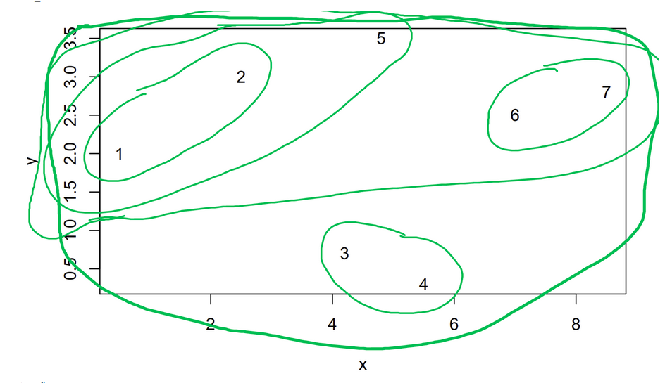

* Answer anonymously, i.e., do not write your name to the answer sheet.
* Submit the answer via Moodle at latest on 6 December 2020 (Moodle submission will open during the week starting on 30 November).
* Your answer will be peer-reviewed by other students and you will review your answer and answers of 2 random peers during the week starting on 7 December.
* The assignment should be completed by one person, but discussions with others are encouraged. Your final solution must be your own.
* The language of the assignments is English.
* The submitted report should be in a single Portable Document Format (pdf) file.
* Answer to the problems in the correct order.
* Read the general instructions in Moodle before starting with the problems.
* Notice that you can submit your answer to the Moodle well before deadline and revise it until the deadline. Therefore: please submit your answer well in advance, alraedy after you have solved some problems!

These are the last exercises. Problems 16-18 are about clustering, which will be covered in the 25 November lecture, and problem 19 about PCA, which will be covered in the 27 November lecture. Problems 18-19 deal directly with the term project data sets: hopefully doing the problems helps you to solve the term project more efficiently. The final problem 20 is the learning diary for the whole course.

2 December lecture will include recap of the course topics and on 4 December we will have machine learning guest lectures (see the last page!).


## Problem 16


```{r}
data <- data.frame(x=c(0,1,4,5,5),y=c(1,2,5,3,4))
```

```{r,echo=FALSE}
plot(c(0,5),c(0,5),type="n",xlab=expression(x),ylab=expression(y))
text(data,rownames(data))
```

### Task a

##### What kind of tasks can we use the Lloyd’s (k-means) algorithm for?

It can be used to partition input data into the k partitions. For example, split data to 3 partitions based on the datapoint values (used in distance calculations).

##### Explain what the inputs and outputs of the algorithm are.

The input data matrix has datapoints x, that are p-dimensional real vectors in space $\mathbb{R}^p$. Model also needs number of how many clusters to cluster the data.

Then optional input parameters. Initial cluster centroids can be set, but this is not generally required.

The output is cluster ID or group for every datapoint and cluster centroids (means).

##### How to interpret the results?

In the results, all the nodes, vertices or points have been clustered, which in the other words means that all the points have got cluster values. This cluster values are set by cluster centroids, that minimize the loss function.


### Task b

Object is to minimize distance between cluster centroids and cluster datapoints. The loss function is:


$$Loss = \sum_{j=1}^k \sum_{i \in D_j} ||x_i-u_j||_2^2=\sum_{i=1}^n ||x_i-u_{j(i)}||_2^2$$

In the every iteration the results (clustering) converges towards the optimal solution (can also converge towards local optima). In the otherwords it means that during every iteration the total amount of loss reduces.


### Task c
Consider the following set of data points in $R^2: x_1 = (0, 1), x_2 = (1, 2), x_3 = (4, 5), x_4 = (5, 3), x_5 = (5, 4).$ Sketch the run of the Lloyd’s algorithm using $K = 2$ and initial prototype (mean) vectors $µ_1 = (0, 2)$ and $µ_2 = (2, 0)$. Draw the data points, cluster prototype vectors, and cluster boundary after each iteration until convergence.

Also, write down calculation procedure and the cluster memberships as well as prototype vectors after each
iteration.

#### Answer

Figures are hand written so the cluster boundaries are estimates of their real locations.


#### Iteration 0 (starting point)


1. $\{x_1, x_2, x_3\}$, new cluster mean $\overline u_1 = (1\frac{2}{3}, 2\frac{2}{3})$

2. $\{x_4, x_5\}$, new cluster mean $\overline u_2 = (5, 3\frac{1}{2})$


#### Iteration 1


1. $\{x_1, x_2\}$, new cluster mean $\overline u_1 = (\frac{1}{2}, 1\frac{1}{2})$

2. $\{x_3, x_4, x_5\}$, new cluster mean $\overline u_2 = (4\frac{2}{3}, 4)$

#### Iteration 2


1. $\{x_1, x_2\}$, new cluster mean $\overline u_1 = (\frac{1}{2}, 1\frac{1}{2})$

2. $\{x_3, x_4, x_5\}$, new cluster mean $\overline u_2 = (4\frac{2}{3}, 4)$


#### Iteration 3


1. $\{x_1, x_2\}$, new cluster mean $\overline u_1 = (\frac{1}{2}, 1\frac{1}{2})$

2. $\{x_3, x_4, x_5\}$, new cluster mean $\overline u_2 = (4\frac{2}{3}, 4)$

Cluster means stay same so k-means Lloyd's algorithm iterations are ready.


# Problem 17
Objectives: understanding hierarchical clustering algorithms

```{r}
data <- data.frame(x=c(0.5,2.5,4.2,5.5,4.8,7.0,8.5),
y=c(2.0,3.0,0.7,0.3,3.5,2.5,2.8))

print(data)
plot(data)
```

### Task a





# Problem 18
Objectives: practical application of k-means and hierarchical clustering


```{r}
npf <- read.csv("npf_train.csv")
## choose variables whose names end with ".mean" together with "class4"
vars <- colnames(npf)[sapply(colnames(npf),
function(s) nchar(s)>5 && substr(s,nchar(s)-4,nchar(s))==".mean")]
npf <- npf[,c(vars,"class4")]

## strip the trailing ".mean" to make the variable names prettier
colnames(npf)[1:length(vars)] <- sapply(colnames(npf)[1:length(vars)],
function(s) substr(s,1,nchar(s)-5))
vars <- colnames(npf)[1:length(vars)]
```

#### Task a

Cluster the rows of the data matrix and plot the k-means loss as a function of the number of clusters from 1 to 20.

```{r}
set.seed(42)
loss1 <- sapply(1:20,function(k) kmeans(scale(npf[,vars]), k, iter.max=100, nstart=100, algorithm="Lloyd")$tot.withinss)
plot(loss1/loss1[1],type="b",xlab="k",ylab="normalised k-means loss", main="Normalized columns")
```
```{r}
set.seed(42)
loss1 <- sapply(1:20,function(k) kmeans(scale(npf[,vars]), k, iter.max=100, nstart=100, algorithm="Lloyd")$tot.withinss)
plot(loss1,type="b",xlab="k",ylab="k-means loss", main="Normalized columns")
```

```{r}
set.seed(42)
loss2 <- sapply(1:20,function(k) kmeans(npf[,vars], k, iter.max=100, nstart=100, algorithm="Lloyd")$tot.withinss)
plot(loss2/loss2[1],type="b",xlab="k",ylab="normalised k-means loss", main="Not normalized columns")
```
```{r}
set.seed(42)
loss2 <- sapply(1:20,function(k) kmeans(npf[,vars], k, iter.max=100, nstart=100, algorithm="Lloyd")$tot.withinss)
plot(loss2,type="b",xlab="k",ylab="k-means loss", main="Not normalized columns")
```

Should you normalise the columns and what effect does the normalization of the columns have?

We see from the graphs that we should normalize the columns before running the k-means algorithm. Some columns seem to have a larger weight before normalization than others, so the clustering does not work properly. This can be seen when we compare "normalized gaphs" and "not normalized graphs" when the k-means loss decreases smoothly in the first one and drops dramatically in the latter one. Also, when comparing not normalized k-means losses, we can see that it is significantly lower in the one with normalized columns.

In other words, when columns are normalized, then all the columns are the same weight, and k-means loss decreases smoothly when k increases.


#### Task b

```{r}
library(clue)
set.seed(42)
# Run k-means
cl <- kmeans(scale(npf[,vars]), centers=4, algorithm="Lloyd", nstart=1, iter.max=100)
## Create confusion matrix between the known classes (class 4) and
## cluster indices.
tt <- table(npf$class4,cl$cluster)
## Find a permutation of cluster indices such that they
## best match the classes in class4.
tt <- tt[,solve_LSAP(tt,maximum=TRUE)]

# Print tt
print("Original confusion matrix")
tt

# Check matrix with normalized columns
print("Confusion matrix with normalized columns")
tt_col <- tt
tt_col[,1] = tt_col[,1]/sum(tt_col[,1])
tt_col[,2] = tt_col[,2]/sum(tt_col[,2])
tt_col[,3] = tt_col[,3]/sum(tt_col[,3])
tt_col[,4] = tt_col[,4]/sum(tt_col[,4])
tt_col = round(tt_col, 2)
tt_col

# Check matrix with normalized columns
print("Confusion matrix with normalized rows")
tt_rows <- tt
tt_rows[1,] = tt_rows[1,]/sum(tt_rows[1,])
tt_rows[2,] = tt_rows[2,]/sum(tt_rows[2,])
tt_rows[3,] = tt_rows[3,]/sum(tt_rows[3,])
tt_rows[4,] = tt_rows[4,]/sum(tt_rows[4,])
tt_rows = round(tt_rows, 2)
tt_rows
```

Best total result can be found when:
Cluster 2 = Ia
Cluster 1 = Ib
Cluster 3 = II
Cluster 4 = nonevent 

If we would use these clusters as a classifiers, our accuracy would be 43%, which is pretty poor result.

As a percent, the cluster 2 is worst, because it would not have predicted anything correctly so the accuracy would be 0 %. 

Then as a count, the worst one is group 3. In the group 3 we have 144 datapoints and only 34 would be predicted correctly.

When we look at the confusion matrix with normalized rows, we can see how different classes have been distributed to different groups. For example class nonevent has 47% in group4, 40% in group3, 8% in group2 and 1% in group 1. Overall, the nonevent datapoints are quite equally distributed in group4 and group 3 so it causes lots of error. There is similar situation with class II, which is in three different groups with percents 55%, 32%, and 13%.


#### Task c

Repeat the clustering of task b above with 1000 different random initialisations. Make histogram of the losses.

```{r}
loss1 <- sapply(1:1000, function(k) kmeans(scale(npf[,vars]), centers=4, iter.max=100, algorithm="Lloyd")$tot.withinss)
hist(loss1, col = 'skyblue3', breaks=10, main="Histogram of k-means loss")
```

What is the minimum and maximum k-means losses for your 1000 random initialisations?

```{r}
summary(loss1)
```

How many initialisations would you expect to need to have to obtain one reasonably good loss (say, a solution with a loss within 1% of the best loss out of your 1000 losses), for this dataset and number of clusters?

```{r}
100*sum(loss1<=min(loss1)+((max(loss1)-min(loss1))/100))/length(loss1)
```

There are 3.6 % of the solutions are in the 1 % of the best loss out. Therefore 28 initializations should be enought (in theory).


Then try how using some smart initialisation such as kmeans++ affects your results

We can see from the results, that while the min and max values stay about same, there is dramatic change in the number of values within 1 % of the loss outs. Therefore kmeans++ improves the results.

```{r}
# kmeansppcenters - Finds initial kmeans++ centroids
# Arguments:
# x numeric matrix, rows correspond to data items
# k integer, number of clusters
# Value:
# centers a matrix of cluster centroids, can be fed to kmeans
#
# Reference: Arthur & Vassilivitskii (2007) k-means++: the
# advantages of careful seeding. In Proc SODA '07, 1027-1035.
kmeansppcenters <- function(x,k) {
  x <- as.matrix(x)
  n <- nrow(x)
  centers <- matrix(NA,k,ncol(x))
  p <- rep(1/n,n)
  for(i in 1:k) {
    centers[i,] <- x[sample.int(n,size=1,prob=p),]
    dd <- rowSums((x-(rep(1,n) %o% centers[i,]))^2)
    d <- if(i>1) pmin(d,dd) else dd
    if(max(d)>0) { p <- d/sum(d) }
  }
  centers
}

#cl <- kmeans(scale(npf[,vars]),centers=kmeansppcenters(scale(npf[,vars]),4),
#algorithm="Lloyd",iter.max=100)

loss2 <- sapply(1:1000, function(k) kmeans(scale(npf[,vars]), centers=kmeansppcenters(scale(npf[,vars]),4), iter.max=100, algorithm="Lloyd")$tot.withinss)

hist(loss2, col = 'skyblue3', breaks=10, main="Histogram of k-means loss when using kmeans++")
```

```{r}
summary(loss2)
```

```{r}
table(npf[,"class4"])
```

How many initialisations would you expect to need to have to obtain one reasonably good loss (say, a solution with a loss within 1% of the best loss out of your 1000 losses), for this dataset and number of clusters?

```{r}
100*sum(loss2<=min(loss2)+((max(loss2)-min(loss2))/100))/length(loss2)
```

There are 21.1 % of the solutions in the 1 % of the best loss out. Therefore 5 initializations should be enought.

#### Task d

Try clustering the same data with agglomerative hierarchical clustering with at least 2 different linkage functions. Produce a dendrogram and corresponding flat clustering (e.g., by splitting the dendrogram with cutree) and compare their properties (e.g., comparing sizes of clusters, by looking at confusion matrices).
Find and report at least one interesting feature or reproduce some of the properties of hierarchical clustering (e.g., differences between the linkage functions) discussed in the lecture. (Hint: See Sections 10.5.2 and 10.6.2 of James et al. for examples in R.)


```{r}
# Set x, scaled column values
x=scale(npf[,vars])

# Cluster with 3 different ways
hc.complete = hclust(dist(x), method="complete")
hc.average =hclust(dist(x), method ="average")
hc.single=hclust(dist(x), method ="single")

# Plot dendrograms
plot(hc.complete, main="Complete Linkage", labels=npf[,"class4"], xlab="", ylab="", sub="", cex=.6)
cutree(hc.complete, 4)

plot(hc.average, main="Average Linkage", labels=npf[,"class4"], xlab="", ylab="", sub="", cex=.6)
cutree(hc.average, 4)

plot(hc.single, main="Single Linkage", labels=npf[,"class4"], xlab="", ylab="", sub="", cex=.6)
cutree(hc.single, 4)
```
```{r}
# Make cutrees
cutree.single = cutree(hc.single, 4)
cutree.average = cutree(hc.average, 4)
cutree.complete = cutree(hc.complete, 4)

# Confusion matrix single vs average
tt = table(cutree.single, cutree.average)
tt <- tt[,solve_LSAP(tt, maximum=TRUE)]
tt

# Confusion matrix single vs complete
tt = table(cutree.single, cutree.complete)
tt <- tt[,solve_LSAP(tt, maximum=TRUE)]
tt

# Confusion matrix average vs complete
tt = table(cutree.average, cutree.complete)
tt <- tt[,solve_LSAP(tt, maximum=TRUE)]
tt
```

## Problem 19

*[25% points]*

*Objectives: uses of PCA*

Continue with the same dataset as in Problem 18 above.

### Task a

Make a PCA projection of the data into two dimensions. Indicate the class index (`class4`), e.g., by color and/or the shape of the glyph. Be sure to indicate which color/shape corresponds to which class, e.g., by `legend`.


```{r}
library(FactoMineR)
# si on veut une ACP non réduite : 
pca = PCA(npf, quali.sup = length(npf))
```

```{r}
plot(pca,choix="ind",habillage = length(npf))
```


### Task b

Compute and plot the proportion of variance explained and the cumulative variances explained for the principal components. Study the effects of different normalisations  - at least compare difference if you do not scale the data at all vs. you normalize each variable to zero mean and unit variance! Why for unnormalized data it seems that fewer components explain a large proportion of the variance, as compared to the normalized data? (Hint: See Sec. 10.4 Fig 10.4 of James et al.)

```{r}
# PCA As done in the book
pr.out = prcomp ( npf[-length(npf)] , scale = FALSE )
```
The variance explained by each principal component is obtained by squaring the Sd:
```{r}
# Variance Explained
pr.var = pr.out$sdev ^2
pr.var
```
To compute the proportion of variance explained by each principal component, we simply divide the variance explained by each principal component by the total variance explained by all four principal components:
```{r}
pve = pr.var/sum(pr.var)
pve
```

We can plot the PVE explained by each component, as well as the cumulative PVE, as follows:
```{r}
plot ( pve , xlab =" Principal Component " , ylab =" Proportio n of Variance Explained " , ylim = c (0 ,1) , type = 'b')
```

```{r}
plot ( cumsum ( pve ) , xlab =" Principal Component " , ylab =" Cumulative Proportio n of Variance Explained " , ylim = c (0 ,1),type ='b')
```

#### Scaled Data
```{r}
pr.out = prcomp ( npf[-length(npf)] , scale = TRUE )
pr.var = pr.out$sdev ^2
pve = pr.var/sum(pr.var)
pve
plot ( pve , xlab =" Principal Component " , ylab =" Proportio n of Variance Explained " , ylim = c (0 ,1) , type = 'b')
plot ( cumsum ( pve ) , xlab =" Principal Component " , ylab =" Cumulative Proportio n of Variance Explained " , ylim = c (0 ,1),type ='b')
```
The first 11 components are 10^-2 terms. I will consider them in the last part but not the rest of the features.

It is normal that with unnormalized data we will have fewer components explaining a large proportion of the variance because without normalizing the data, features with big numbers will be dominant compared to the ones with small numbers.

### Task c 

Pick one classification algorithm that is implemented in R or SciPy or in your other favourite environment that would work with this data and choose one of the challenge performance measures (binary accuracy, multiclass accuracy, or perplexity). Split the data in random into training and validation sets of equal sizes. Train your classification algorithm first without the dimensionality reduction on the training set and report the performance (=your chosen performance measure) on the validation set. Do the same on the data where the dimensionality has been reduced by the PCA (see task b above). How does the performance of your classifier vary with the (reduced) dimensionality and is there an "optimal" dimensionality which gives you the best performance on the validation set?

Hint: Notice that you can do the PCA on the combined training and validation sets. This is a simple form of semi-supervised learning: this way you can utilise the structure of the validation/test set even if you don't know the class labels on the validation/test set!
`
```{r}
data = npf
data$class4 = factor(data$class4)
set.seed(1)
n <- nrow(data)
p <- ncol(data)-1
test.ratio <- .5 # ratio of test/train samples
n.test <- round(n*test.ratio)
tr <- sample(1:n,n.test)
data.val <- data[tr,]
data.train <- data[-tr,]
```

```{r}
set.seed(0)
#install.packages("randomForest")
library(randomForest)
fit_RF <- randomForest(class4 ~ . , data.train)

pred_RF <- predict(fit_RF, newdata = data.val, type="prob")
#pred_RF

class_RF <- predict(fit_RF,newdata=data.val, type="response")
#class_RF
accuracy = mean(data.val$class4 == class_RF)
accuracy
```

```{r}
set.seed(0)
pr.out = prcomp ( data.train[-length(npf)] , scale = TRUE )
pr.var = pr.out$sdev ^2
pve = pr.var/sum(pr.var)

accuracy = 1:20;
for (n in 1:50) {
pca = pr.out
loadings <- as.data.frame(pca$x)
loadings2 <- loadings[1:n]
pca_train2 = as.data.frame(loadings2)
pca_train2$class4 = data.train$class4

fit_RF2 <- randomForest(class4 ~ . , pca_train2)


pca_test <- data.val[-length(data.val)]
pca_test2 <- predict(pca, newdata = pca_test)
pca_test2 <- as.data.frame(pca_test2)
pca_val <- as.data.frame(pca_test2[1:n])
pca_val$class4 <- data.val$class4

predict_val <- predict(fit_RF2,pca_val)
accuracy[n] = mean(data.val$class4 == predict_val)
}
accuracy
```

```{r}
loadings <- as.data.frame(pr.out$x)
```


## Problem 20

The length of your reply should be 3-6 paragraphs of text. Guiding questions: What did I learn? What did I not understand? Was there something relevant for other studies or (future) work? Notice that this entry should typically be longer than your earlier learning diary entries in E1 and E2.

Overall, I enjoyed this course and learn so much from it. Personally, I have already done an internship in which I applied some machine learning techniques. However, even though I had some knowledge around it, I needed to have this knowledge structured and know the theorical part behind every technique I apply. I used to apply machine learning methods without understanding them and just taking the one with the best results. However, now I feel more comfortable and sure of what I am doing when working on a machine learning project. In addition, if I have a model that isn't working (over/under fitting), now I can understand the cause of it and try to analyze and do some transformations that could make the work done.

Now I am more applied in the supervised and unsupervised techniques. I know when to use them, which model works better in which case and know many ways to study the performance. In addition, now I know how to use an unsupervised learning method as PCA in order to improve the results of a supervised model. Before the course I didn't knew anything abour the perplexity. I only compared my models based on the accuracy. Therefore, now I can see the problems from different perspectives. I also learned the difference between Generative and Discriminative learning. 

I didn't had the habit of using pure statistical learning and probabilistic modelling. While now I alwas consider these kinds of techniques. I also been introduced to SVM a method that I didn't know before the course.

At the end, let's not forget to mention the improvement I made in R programming. I progressed so much in R coding from basics to machine learning. During the exercises, I used so many functions and functionalities of R that I didn't know before this course. And the programming level of the course was not easy while staying managable. Also the reference book helped me a lot in this manner. The book was a great support for the accomplishment of this course.

Overall, as a futur data scientist, I can say that now I have the needed basic knowledge to go and work on new projects and to learn more and improve my skills in Machine learning. This course was a great introduction to this topic and made me ready to face new problems and gave me a solid base to build on.
